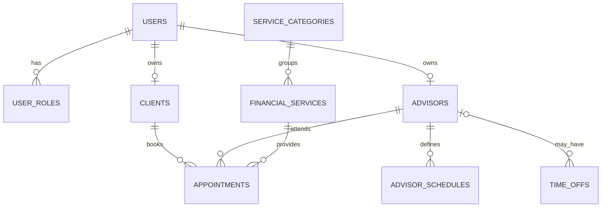

# Modelo de datos base

Este documento guía la reescritura de `V1__init_schema.sql`. Describe el resultado esperado,
pero deja la traducción a DDL como ejercicio de implementación. V1 contiene el núcleo que ya
representa la aplicación; tablas de sesiones, MFA, sedes, competencias, notificaciones,
idempotencia e historial se añadirán con sus módulos en migraciones posteriores.

## Diagrama de V1

`advisor_id` nulo en `time_offs` representa un bloqueo institucional. En una migración futura,
sedes y modalidad harán explícito dónde y cómo se presta cada bloque.

## Criterios comunes

- Claves primarias UUID generadas por la aplicación, sin secuencias numéricas.
- Instantes como `TIMESTAMP WITH TIME ZONE`; horas recurrentes como `TIME`.
- Todas las tablas de negocio tienen `created_at` y `updated_at`. La base puede asignar el valor
  inicial, pero JPA es responsable de actualizar `updated_at`.
- Nombres de constraints e índices explícitos y comprensibles.
- Valores cerrados como rol o estado usan `VARCHAR` y `CHECK`, no enum de PostgreSQL, para que
  una migración futura pueda ampliarlos con menor fricción.
- Las relaciones históricas usan `ON DELETE RESTRICT`. `CASCADE` se limita a asociaciones puras,
  como los roles de una cuenta que realmente se elimina en un entorno sin historia.
- La aplicación normaliza texto; la base conserva la garantía final de unicidad e integridad.

## Diccionario de tablas

### `users`

| Columna | Tipo/forma | Reglas |
| --- | --- | --- |
| `id` | UUID | PK |
| `email` | VARCHAR(254) | obligatorio; índice único sobre `lower(email)` |
| `password_hash` | VARCHAR(255) | obligatorio; nunca guardar contraseña reversible |
| `email_verified_at` | TIMESTAMPTZ | nulo hasta verificar correo |
| `is_active` | BOOLEAN | obligatorio, valor inicial verdadero |
| auditoría | TIMESTAMPTZ | creación y actualización |

No combines `UNIQUE(email)` con el índice funcional: serían dos garantías diferentes y la
primera permitiría diferencias solo por mayúsculas que la segunda rechazará de todos modos.

### `user_roles`

| Columna | Tipo/forma | Reglas |
| --- | --- | --- |
| `user_id` | UUID | FK a `users` |
| `role` | VARCHAR(30) | `CLIENT`, `ADVISOR` o `ADMIN` |

La PK compuesta `(user_id, role)` impide repetir un rol y permite que una cuenta tenga varios.
La coherencia entre rol y existencia de perfil se valida en la capa de aplicación.

### `clients`

| Columna | Tipo/forma | Reglas |
| --- | --- | --- |
| `id` | UUID | PK |
| `user_id` | UUID | FK obligatoria y única |
| `full_name` | VARCHAR(120) | obligatorio |
| `phone_number` | VARCHAR(16) | obligatorio; la aplicación valida E.164 |
| auditoría | TIMESTAMPTZ | creación y actualización |

V1 no contiene tipo ni número de documento. Es una decisión de minimización de datos, no un
campo pendiente.

### `advisors`

| Columna | Tipo/forma | Reglas |
| --- | --- | --- |
| `id` | UUID | PK |
| `user_id` | UUID | FK obligatoria y única |
| `full_name` | VARCHAR(120) | obligatorio |
| `internal_code` | VARCHAR(30) | obligatorio y único sin distinguir mayúsculas |
| `specialization` | VARCHAR(120) | descripción breve obligatoria |
| `is_active` | BOOLEAN | desactivación operativa sin borrar historia |
| auditoría | TIMESTAMPTZ | creación y actualización |

### `service_categories`

| Columna | Tipo/forma | Reglas |
| --- | --- | --- |
| `id` | UUID | PK |
| `name` | VARCHAR(100) | único sin distinguir mayúsculas |
| `description` | VARCHAR(500) | opcional |
| `is_active` | BOOLEAN | desactivación en vez de eliminación |
| auditoría | TIMESTAMPTZ | creación y actualización |

### `financial_services`

| Columna | Tipo/forma | Reglas |
| --- | --- | --- |
| `id` | UUID | PK |
| `category_id` | UUID | FK obligatoria con borrado restringido |
| `name` | VARCHAR(120) | único por categoría sin distinguir mayúsculas |
| `description` | VARCHAR(1000) | opcional |
| `duration_minutes` | INTEGER | positivo, máximo razonable y múltiplo de 15 |
| `is_active` | BOOLEAN | obligatorio |
| auditoría | TIMESTAMPTZ | creación y actualización |

La política específica por servicio se incorporará junto al módulo de catálogo. V1 usa los
valores institucionales predeterminados definidos en producto.

### `advisor_schedules`

| Columna | Tipo/forma | Reglas |
| --- | --- | --- |
| `id` | UUID | PK |
| `advisor_id` | UUID | FK obligatoria |
| `day_of_week` | INTEGER | ISO-8601: 1 lunes a 7 domingo |
| `start_time` | TIME | obligatorio |
| `end_time` | TIME | posterior a `start_time` |
| auditoría | TIMESTAMPTZ | creación y actualización |

V1 impide bloques idénticos duplicados. La detección de cruces entre horarios recurrentes queda
en el módulo de disponibilidad, donde también se añadirán modalidad y sede.

### `time_offs`

| Columna | Tipo/forma | Reglas |
| --- | --- | --- |
| `id` | UUID | PK |
| `advisor_id` | UUID | FK opcional; nulo significa bloqueo institucional |
| `starts_at` | TIMESTAMPTZ | obligatorio |
| `ends_at` | TIMESTAMPTZ | posterior a `starts_at` |
| `reason` | VARCHAR(500) | obligatorio para trazabilidad operativa |
| auditoría | TIMESTAMPTZ | creación y actualización |

Un intervalo permite representar tanto un feriado completo como una ausencia parcial. La
aplicación debe construir los feriados usando explícitamente la zona `America/Lima`.

### `appointments`

| Columna | Tipo/forma | Reglas |
| --- | --- | --- |
| `id` | UUID | PK |
| `client_id` | UUID | FK obligatoria y restringida |
| `advisor_id` | UUID | FK obligatoria y restringida |
| `service_id` | UUID | FK obligatoria y restringida |
| `starts_at` | TIMESTAMPTZ | inicio visible de la cita |
| `ends_at` | TIMESTAMPTZ | posterior a `starts_at`; fin visible |
| `blocked_until` | TIMESTAMPTZ | igual o posterior a `ends_at`; incluye el búfer |
| `status` | VARCHAR(30) | `CONFIRMED`, `COMPLETED`, `CANCELLED` o `NO_SHOW` |
| `reason` | VARCHAR(500) | motivo breve aportado por el cliente |
| `client_comment` | VARCHAR(1000) | opcional; no admite datos financieros sensibles |
| `consented_at` | TIMESTAMPTZ | obligatorio como evidencia del consentimiento |
| `version` | BIGINT | obligatorio, inicia en cero para bloqueo optimista |
| auditoría | TIMESTAMPTZ | creación y actualización |

La garantía contra doble reserva considera el rango semiabierto
`[starts_at, blocked_until)`. Así una cita puede empezar exactamente cuando termina el tiempo
bloqueado de la anterior. Solo las citas `CONFIRMED` participan en la restricción.

PostgreSQL permite expresar esta regla con un rango `tstzrange`, una constraint de exclusión
GiST y `btree_gist` para combinar igualdad de asesor con solapamiento temporal. Consulta la
[documentación oficial de rangos y constraints de exclusión](https://www.postgresql.org/docs/17/rangetypes.html#RANGETYPES-CONSTRAINT).

## Índices mínimos que deben justificarse

- Login por `lower(users.email)`; además proporciona la unicidad.
- Servicios por `category_id` y nombre normalizado.
- Horarios por `(advisor_id, day_of_week)`.
- Ausencias por asesor e inicio, además de una ruta para bloqueos institucionales.
- Citas por `(advisor_id, starts_at)` y por `(client_id, starts_at DESC)`.
- El índice GiST creado por la exclusión cubre la búsqueda de conflictos, pero no reemplaza
  automáticamente todos los índices de listados.

No indexes cada foreign key de forma automática: relaciónala con una consulta real y revisa el
orden de sus columnas.

## Orden sugerido dentro de V1

1. Extensiones estrictamente necesarias.
2. Identidad y perfiles.
3. Catálogo.
4. Horarios y ausencias.
5. Citas.
6. Constraints que dependan de extensiones e índices de consulta.

V1 puede reescribirse porque el proyecto aún considera descartables sus bases locales. Una vez
publicada como baseline estable, no se editará: Flyway aplica cada migración versionada una vez y
valida su checksum, por lo que los cambios siguientes se expresarán con nuevas migraciones. Véase
la [documentación oficial de migraciones versionadas de Flyway](https://documentation.red-gate.com/fd/versioned-migrations-273973333.html).

## Criterios de aceptación del ejercicio

- Una base PostgreSQL vacía aplica V1 sin intervención manual.
- Una segunda ejecución no intenta recrear objetos ni modifica el esquema.
- Todas las tablas, FK, checks, constraints e índices tienen nombres consistentes.
- Se rechazan correo duplicado con distinta capitalización, duración inválida, intervalo invertido,
  rol/estado desconocido y dos citas confirmadas superpuestas para el mismo asesor.
- Se aceptan citas adyacentes y cruces horarios para asesores diferentes.
- Cancelar una cita libera su intervalo para una nueva reserva.
- Hibernate puede validar el esquema después de alinear las entidades en el siguiente bloque.
